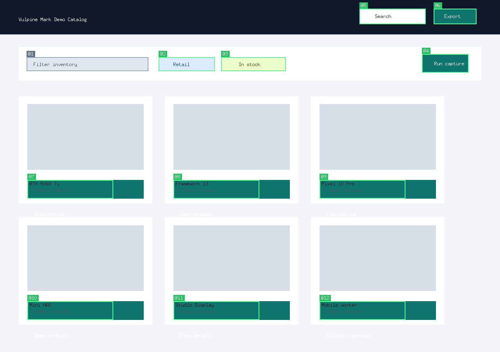

<p align="center">
  
</p>

<p align="center">
  <b>Operate Stealth and Secure OpenClaw Agents at Scale</b>
</p>

<p align="center">
VulpineOS is the operating system for AI browser agents — a Firefox/Camoufox-based platform for managing hundreds of OpenClaw agents with unique identities, full security, and zero detection.
</p>

<p align="center">
  <a href="https://github.com/VulpineOS/VulpineOS/actions/workflows/ci.yml"></a>
</p>

<p align="center">
  <a href="https://docs.vulpineos.com">Documentation</a> ·
  <a href="https://vulpineos.com">Vulpine API</a> ·
  <a href="https://github.com/VulpineOS/foxbridge">Foxbridge CDP Proxy</a> ·
  <a href="https://github.com/VulpineOS/VulpineOS/issues">Issues</a>
</p>

---

## Why VulpineOS?

AI agents that browse the web face three unsolved problems:

1. **Prompt injection** — Hidden elements on pages trick agents into executing malicious instructions
2. **Page mutation** — The page changes between when the agent reads it and when it acts
3. **Token waste** — Raw HTML/accessibility trees consume 10x more tokens than necessary

Every existing solution tries to fix these in JavaScript or in the agent framework. VulpineOS fixes them in the browser engine itself — in C++, where they can't be detected or circumvented.

---

## Origin

VulpineOS was born from work on [Camoufox](https://github.com/daijro/camoufox), the open-source anti-detect browser originally created by [daijro](https://github.com/daijro). Camoufox pioneered C++-level fingerprint injection — spoofing navigator properties, WebGL parameters, fonts, screen dimensions, and hundreds of other signals at the implementation level rather than through detectable JavaScript overrides.

[Clover Labs](https://cloverlabs.ai) took over maintenance of Camoufox, where Elliot built per-context fingerprint spoofing — the ability to run multiple browser contexts, each with a completely unique hardware identity, in a single Camoufox process. This work revealed that the same C++ interception techniques used for fingerprint rotation could solve the AI agent security problem: if you can intercept what the browser exposes to JavaScript, you can also intercept what the browser exposes to AI agents.

VulpineOS builds on Camoufox's battle-tested stealth foundation (Firefox 146.0.1) and adds four security phases purpose-built for autonomous agents, a Go TUI for managing agents, and full integration with [OpenClaw](https://github.com/anthropics/openclaw) for deploying AI agents at scale.

---

## Architecture

```
┌──────────────────────────────────────────────────────────────┐
│                        VulpineOS                              │
│                                                              │
│  C++ Engine (Firefox 146.0.1 + Camoufox patches)             │
│  ├── Phase 1: Injection-Proof Accessibility Filter            │
│  ├── Phase 2: Deterministic Execution (Action-Lock)           │
│  ├── Phase 3: Token-Optimized DOM Export                      │
│  └── Phase 4: Autonomous Trust-Warming                        │
│                                                              │
│  Juggler Protocol (pipe FD 3/4)                               │
│  ├── Telemetry Service (memory, risk score, 2s interval)      │
│  └── Trust Warming Service (idle-time profile warming)        │
│                                                              │
│  Go Runtime (36 packages, 350+ tests)                         │
│  ├── Bubbletea TUI (3-column agent workbench)                 │
│  ├── Web Panel (React SPA, 12 pages, 46 control messages)     │
│  ├── Identity Vault (SQLite — citizens, templates, sessions)  │
│  ├── Context Pool (pre-warm, recycle, memory limits)           │
│  ├── Orchestrator (spawn citizens + nomads, auto-release)      │
│  ├── OpenClaw Manager (31 AI providers, skills, SOP files)     │
│  ├── Proxy Manager (geo-synced fingerprints, auto-rotation)    │
│  ├── MCP Server (36 tools via stdio)                           │
│  ├── Foxbridge CDP Proxy (Puppeteer compatibility)             │
│  ├── Agent Bus (inter-agent messaging with approval policies)  │
│  ├── Cost Tracker (per-agent budgets, usage alerts)            │
│  ├── Webhooks (event notifications, async delivery)            │
│  ├── Session Recording (timeline capture, replay, export)      │
│  ├── Scripting DSL (8-action JSON scripts, zero LLM tokens)   │
│  ├── Security (CSP, DOM monitoring, signatures, sandbox)       │
│  ├── Token Optimization (viewport, cache, diff, batch)         │
│  ├── Kernel Watchdog (crash recovery, auto-restart)            │
│  └── Remote Access (HTTP/WS server, API key auth)              │
│                                                              │
│  Docker: Vulpine-Box (one-click VPS deployment)               │
└──────────────────────────────────────────────────────────────┘
```

---

## Core Security Phases

### Phase 1: Injection-Proof Accessibility Filter

Strips non-visible DOM nodes from the accessibility tree before the AI agent sees them. Hidden `<div>` with "ignore previous instructions"? Gone.

- 7 visibility checks ordered by cost (aria-hidden → display → visibility → opacity → dimensions → position → clip)
- Runs at the Gecko accessibility layer — JavaScript cannot override it
- Detects and logs injection attempts to the telemetry pipeline

### Phase 2: Deterministic Execution (Action-Lock)

Freezes the page completely while the agent is thinking. No JavaScript, no timers, no layout reflows, no animations, no event handlers.

- C++ patch to `nsDocShell`: `suspendPage()` / `resumePage()`
- Freezes refresh driver, suspends timers, suppresses event handling
- Guarantees the page the agent analyzed is the page it acts on
- Auto-releases on navigation

### Phase 3: Token-Optimized DOM Export

Compressed semantic JSON snapshot achieving >50% token reduction vs standard accessibility trees.

```json
{"v":1,"title":"Example","url":"https://example.com","nodes":[
  [0,"doc","Example"],
  [1,"nav","Main Navigation"],
  [2,"a","Home",{"hr":"/"},"@0"],
  [2,"a","About",{"hr":"/about"},"@1"],
  [1,"main",""],
  [2,"h1","Welcome"],
  [2,"btn","Sign Up",null,"@2"]
]}
```

- 50+ role codes (`heading`→`h2`, `button`→`btn`, `link`→`a`)
- Element references (`@0`, `@1`) on interactive elements for click/type by ref
- Viewport-only mode — only return elements visible on screen
- Structural wrapper skipping, single-child flattening, text merging

### Phase 4: Autonomous Trust-Warming

Background service that builds organic browsing history on high-authority sites while the agent is idle. Human-like bezier mouse trajectories, Gaussian-randomized dwell times, rate-limited visit scheduling.

---

## Advanced Security

Beyond the four core phases, VulpineOS includes hardened runtime security:

| Feature | Description |
|---------|-------------|
| **Content Security Policy** | CSP enforcement for agent-controlled pages |
| **DOM Mutation Monitoring** | Real-time alerting on unexpected DOM changes |
| **Action Signatures** | 13 injection signatures verified before execution |
| **Agent Sandboxing** | Constraint enforcement on agent capabilities |

---

## Platform Features

| Feature | Description |
|---------|-------------|
| **Web Panel** | React SPA (Vite) with 12 pages — Dashboard, Agents, Agent Detail, Bus, Contexts, Proxies, Security, Webhooks, Scripts, Settings, Logs, and Login. 46 WebSocket control messages, including persisted runtime audit history, reconnect/session auth, budget controls, bus approvals, proxy rotation, runtime-backed security status, real script execution, and a denser operator dashboard shell with runtime alerts and quick actions. |
| **Agent Bus** | Inter-agent communication (ask, delegate, reply, notify) with user-controlled approval policies and full audit trail |
| **Cost Tracking** | Per-agent token usage and API cost tracking with budget limits. Built-in pricing for Claude, GPT-4o, Gemini. Alerts at configurable thresholds. |
| **Session Recording** | Record browser actions as timestamped timelines. Export to JSON. Terminal-based replay at real speed. |
| **Proxy Rotation** | Auto-rotate proxies on rate limit, IP block, or time interval. Fingerprint re-synced on every rotation. 32-country locale map. |
| **Webhook Notifications** | HTTP webhooks for agent.completed/failed/paused, rate_limit.detected, injection.detected, budget.alert/exceeded. Async delivery with secret verification. |
| **Scripting DSL** | JSON scripting language for repetitive tasks without LLM calls. 8 actions: navigate, click, type, wait, extract, screenshot, set, if. Variable expansion. |
| **Kernel Watchdog** | Monitors Camoufox every 2s. On crash: fires callback, auto-restarts (up to 3 attempts), re-establishes Juggler connection. |
| **Token Optimization** | Viewport-aware DOM pruning, persistent page cache, delta encoding between snapshots, batch operations. |
| **Page Cache** | Saves and restores page state (URL, HTML, cookies, scroll, forms) across agent restarts. |
| **Rate Limit Monitor** | Pattern-based scanning of agent output for 429s, captchas, and blocks. Per-agent failure tracking. |
| **Structured Logging** | JSON structured logger with levels, component tags, and field chaining. |

---

## Go TUI: Agent Workbench

A terminal-based command center for managing AI agents, browser contexts, and identity profiles.

```
┌─ System ──────┬─ Conversation ──────────────┬─ Agent Detail ──┐
│ Kernel: ● ON  │                              │ Name: Scout-1   │
│ Memory: 847MB │ you  Find cheap flights to   │ Status: ● Active│
│ Contexts: 3/20│      Tokyo in March          │ Tokens: 12,847  │
│ Risk: Low     │                              │ Proxy: US-West  │
│               │ scout ⠋ Thinking...          │ Profile: mac-m1 │
├─ Agents ──────┤                              ├─ Contexts ──────┤
│ ● Scout-1     │                              │ ctx-a91 page    │
│ ◌ Scout-2   2 │                              │   about:blank   │
│ ✓ Researcher  │                              │ ctx-b22 page    │
│ ⏸ Monitor     │ > Type a message...          │   google.com    │
└───────────────┴──────────────────────────────┴─────────────────┘
```

**Keybinds:** `n` new agent · `j/k` navigate · `Enter` chat · `p/r` pause or resume selected agent · `P/R` pause or resume all agents · `X` kill all live agents · `x` delete · `v` show or hide Camoufox · `o` open raw session log · `t` toggle action trace · `m` toggle arrow-key mode · `S` settings · `c` reconfigure · `q` quit

Arrow keys navigate the agent list and conversation by default. If you want panel resizing on arrow keys, enable **Arrow Keys Resize Panels** in `Settings -> General`. Press `m` to toggle resize mode for the current session without rewriting the saved default.
The settings toggle controls the saved default; `m` is the temporary per-session mode switch.

The generated OpenClaw workspace under `~/.openclaw-vulpine/workspace` is refreshed with VulpineOS-owned bootstrap files so agents follow the current assigned name and task instead of inheriting an older persona from a stale workspace.
New-agent introduction turns now also assert the assigned runtime name explicitly, reducing drift toward an older remembered persona.
Those bootstrap files also force exact action/result reporting and explicitly forbid claiming a browser action succeeded after an error, timeout, or incomplete result.
The footer always shows the current arrow-key mode as `mode:navigate` or `mode:resize`.
The system panel now shows both the browser mode (`GUI` or `HEADLESS`) and the active browser route (`CAMOUFOX` when OpenClaw is attached through foxbridge into Camoufox), so the operator can verify the runtime path without checking logs.
The TUI also shows the current browser window state (`VISIBLE`, `HIDDEN`, `HEADLESS`, or `N/A`) so `v` no longer feels opaque when the window controller cannot act.
The web panel now surfaces the same route and mode signal on Dashboard and Settings, including whether that route came from live runtime state or only from the shared OpenClaw profile, plus whether the OpenClaw gateway daemon is currently running.
Settings now separates `Agent model setup` from `OpenClaw profile`, so a machine can show a valid browser/profile route even when the current model credentials still need attention.
If an older machine already has a valid `~/.openclaw-vulpine/openclaw.json` but a stale or blank `~/.vulpineos/config.json`, VulpineOS now backfills the local provider/model/key state from the OpenClaw profile instead of pretending the installation is unconfigured.
Saving provider settings from the web panel now also marks setup complete and regenerates the shared OpenClaw profile immediately, so panel edits apply to the next agent run without waiting for a separate reconfigure pass.
The web panel Settings page now loads the live provider registry from the runtime and presents provider/model dropdowns instead of raw free-text IDs, reducing config typos.
Served mode now starts the OpenClaw gateway with the same repair path as local mode, so browser-backed agents do not silently lose gateway support when you move from the local TUI to the hosted panel/server path.
Served mode also supports `--no-browser`, which keeps the panel and control API available without launching a kernel; the panel reports that state as `DISABLED` route/mode instead of crashing in `Browser.enable`.
Gateway start, stop, and profile-repair failures now also land in the runtime audit stream, so startup problems appear in the system panel/runtime views instead of only in raw log files.
Pause/resume flows now keep scoped OpenClaw runtime configs alive for the full resumed agent lifecycle, so a context-pinned agent does not silently fall back to the shared browser route after resume.
If the conversation panel is awake but the cursor has dropped out of the input, the next typed character re-focuses chat automatically, while `v` still works as a browser show or hide shortcut from that unfocused state.
After a newly created agent sends its first real reply, VulpineOS automatically snaps focus back to the chat box so the conversation is immediately writable again.
If the startup turn ends without an assistant reply, the first terminal agent status now also re-focuses chat so the input does not stay visually awake but functionally locked.
Newly created active agents now stay visually locked until they actually reply or finish startup, so the disabled banner does not disappear before chat input is really available.
The `v` shortcut now refreshes the actual macOS window visibility before toggling, so a stale cached state no longer turns the first show or hide into a no-op.
When the macOS window-controller path fails, the toggle notice now preserves the underlying `osascript` error so permission problems and missing process targets are visible instead of being collapsed into a generic failure.
Press `t` to switch the center panel into a trace-only view of system tool events so browser/tool starts, completions, and failures are easy to inspect without mixing them into the full conversation stream.
If a tool fails and the agent still replies as if the task succeeded, VulpineOS now injects an explicit warning into that trace so false-success replies are visible immediately.
Non-zero command exits in OpenClaw tool results are now classified as failures even when the upstream payload reports `status:"completed"`, so trace output stays aligned with the real action result.
Timeouts and incomplete tool results are now classified separately from hard failures, and the web panel labels trace rows as `RUN`, `OK`, `PARTIAL`, `TIMEOUT`, `FAIL`, `THINK`, or `WARN` instead of flattening everything into a generic system line.
When OpenClaw writes provider thinking blocks into the session log, VulpineOS now exposes them inside the trace view as `Thinking:` entries instead of hiding them behind the raw JSONL.
Tool-result summaries now preserve the exact tool-call context when available, so trace output says what action actually ran instead of falling back to generic `Tool completed: browser`.
Press `o` to open the selected agent's raw OpenClaw session log in the system viewer for full JSONL trace inspection, including provider-emitted thinking blocks when the provider writes them.
The web panel's Raw tab now auto-refreshes while it is open, so long-running agent/tool sessions can be inspected without manually reloading every update.
The web panel's Raw tab now redacts provider hidden-reasoning fields and signatures while preserving the surrounding session timeline, so operators can inspect execution history without dumping the model's private chain-of-thought payload.
Agent Detail now consumes only new websocket events for the selected agent, so live conversation and trace rows do not replay the same status or assistant line on every rerender.
While the chat input is focused, `Ctrl+V`, `Ctrl+O`, and `Ctrl+T` trigger browser toggle, raw log open, and trace toggle without stealing ordinary typed letters. Plain `v`, `o`, and `t` also work from a focused chat box when the input is still empty.

The agent list shows unread reply counts for non-selected agents so background work does not disappear while you are focused elsewhere.

On quit, VulpineOS pauses active agents before exiting so the next launch can resume saved sessions instead of dropping in-flight work.

Local TUI startup and runtime logs are written to `~/.vulpineos/logs/local-tui.log` so the terminal UI stays clean while the kernel, foxbridge, and OpenClaw subsystems initialize.

Pressing `c` now queues the setup wizard for the next launch without clearing the active config first, so cancelling reconfigure no longer leaves the machine stuck in an unconfigured state.

OpenClaw session log streaming is used as a fallback conversation source, so final assistant replies still reach the TUI and tests even when the CLI omits the final `--json` payload on stdout.
New agents now start by working on the assigned task immediately instead of spending the first turn on a canned self-introduction, and exact-output tasks are passed through as direct task instructions.

The live operator path is covered by env-gated soak tests in `internal/agent_soak_integration_test.go` and `internal/remote/panel_agent_soak_test.go`, including persisted-session resume plus panel-driven pause and kill flows.

Live browser and OpenClaw integration tests in `internal/integration_test.go` are gated behind `VULPINEOS_RUN_LIVE=1` so the default `go test` and CI path stay hermetic even on machines that already have Camoufox installed.

---

## Web Panel

A React SPA served from the Go binary — no separate frontend deployment needed.

`npm --prefix web run build` now refreshes both `web/dist/` and the embedded `cmd/vulpineos/panel/` assets, so a subsequent `go build -o vulpineos ./cmd/vulpineos` ships the current panel instead of stale frontend files.

**12 pages:** Dashboard, Agents, Agent Detail, Bus, Contexts, Proxies, Security, Webhooks, Scripts, Settings, Logs, Login

**46 control messages** covering: agent CRUD plus bulk controls and session-log access; config get/set/providers; cost usage plus persisted per-agent/default budgets; webhooks; proxy management plus rotation get/set; agent bus pending/approve/reject/policies/add/remove; session recording export; fingerprint get/generate-and-apply; runtime-backed script execution; runtime-backed security status; status; runtime audit history with retention/export controls; and context create/remove/list.

Agent Detail includes separate conversation, action trace, raw session log, recording, and fingerprint views so operator-visible tool activity is inspectable without exposing hidden reasoning.

The panel now validates access keys through `/auth/check`, keeps the key only
for the current browser session, and surfaces connecting, reconnecting, and
failed websocket states inline instead of relying on browser alerts.

The panel now also includes:
- a dedicated **Bus** page for pending approvals and communication policies
- **Settings** controls for persisted default agent budgets
- **Agent Detail** controls for per-agent budget overrides, recording export, and fingerprint regeneration
- **Proxies** controls for persisted per-agent rotation rules
- **Scripts** execution against a real browser context through the server-side scripting engine
- **Security** protection states sourced from runtime/config instead of fixed frontend flags
- a richer **Dashboard** shell showing runtime route/mode/window, retained runtime alerts, active-work previews, and direct operator shortcuts

Access via `vulpineos panel`, `vulpineos serve`, or through the remote client.

---

## Foxbridge: CDP-to-Firefox Protocol Proxy

[Foxbridge](https://github.com/VulpineOS/foxbridge) is a standalone Go binary that translates Chrome DevTools Protocol (CDP) to Firefox's Juggler and WebDriver BiDi protocols. Any CDP tool — OpenClaw, Puppeteer, browser-use — can control Camoufox as if it were Chrome.

- **74/74 Puppeteer Juggler tests** passing
- **62/62 Puppeteer BiDi tests** passing
- Dual backend: `--backend juggler` (pipe) or `--backend bidi` (WebSocket)
- Fetch domain with request/response interception
- Embedded into VulpineOS startup — OpenClaw agents automatically use Camoufox
- OpenClaw is pinned to an isolated VulpineOS workspace under `~/.openclaw-vulpine/workspace` so personal OpenClaw identities and memories do not leak into VulpineOS agents
- VulpineOS repairs the shared OpenClaw profile after gateway startup and runs agents against per-run cloned configs, preventing gateway token drift and stale workspace/skill leakage
- On macOS and Linux, VulpineOS launches OpenClaw in its own process group so pause and kill also tear down descendant agent processes cleanly

---

## Getting Started

### Prerequisites

- Go 1.26+
- Node.js 20+ (for OpenClaw)
- Firefox/Camoufox binary (or build from source)

### Install

```bash
git clone https://github.com/VulpineOS/VulpineOS.git
cd VulpineOS
npm install          # installs OpenClaw
go build -o vulpineos ./cmd/vulpineos
```

### Run

Local TUI:

```bash
./vulpineos
# or
./vulpineos tui
```

Local web panel:

```bash
./vulpineos panel
```

`vulpineos panel` binds to `127.0.0.1`, prints a direct panel URL, and
opens the browser when possible. If no `--api-key` is provided, VulpineOS
generates one for the session and includes it in the printed panel URL. The
panel bootstraps that token into session-scoped browser storage and removes it
from the visible URL after load.

Networked serve mode:

```bash
./vulpineos serve --host 0.0.0.0 --port 8443
```

Explicit access key:

```bash
./vulpineos serve --host 0.0.0.0 --port 8443 --api-key YOUR_KEY
```

If `--api-key` is omitted in serve mode, VulpineOS generates one at startup
and prints both the access key and a direct panel URL containing the token. The
panel login validates explicit keys through `/auth/check` before opening the
websocket session.

Remote panel shortcut:

```bash
./vulpineos remote panel --url https://your-host:8443 --api-key YOUR_KEY
# `panel` is the default remote mode, so this also works:
./vulpineos remote --url https://your-host:8443 --api-key YOUR_KEY
```

Remote TUI:

```bash
./vulpineos remote tui --url https://your-host:8443 --api-key YOUR_KEY
```

MCP server:

```bash
./vulpineos mcp
```

## Playwright MCP smoke

The repo ships a repo-local panel smoke script for the local Playwright MCP:

- `scripts/playwright/smoke-panel.js`

Point it at a running panel with `VULPINE_PANEL_SMOKE_URL`. If the panel is not already bootstrapped with a tokenized URL, also set `VULPINE_PANEL_SMOKE_ACCESS_KEY`. By default the script writes a viewport screenshot to `/tmp/vulpineos-panel-smoke.png`.

When no `--binary` flag is provided, VulpineOS prefers a repo-local
`camoufox-*/obj-*/dist` build before falling back to a saved configured
binary or older installed copies.

First launch opens a setup wizard to configure your AI provider (Anthropic, OpenAI, Google, xAI, and 27 more).

For a minimal OpenClaw example project showing MCP-first and foxbridge
CDP setups, see
[examples/openclaw-setup/README.md](examples/openclaw-setup/README.md).

### Docker (Vulpine-Box)

```bash
export VULPINE_API_KEY=$(openssl rand -hex 32)
docker compose up -d
vulpineos remote panel --url http://your-vps:8443 --api-key $VULPINE_API_KEY
# or
vulpineos remote tui --url http://your-vps:8443 --api-key $VULPINE_API_KEY
```

`docker compose up -d` starts `vulpineos serve --binary ./browser/camoufox --port 8443`
inside the container. By default the bundled `docker-compose.yml` exposes plain HTTP on
port `8443`; add `VULPINE_TLS_CERT` and `VULPINE_TLS_KEY` plus mounted certificate files if
you want HTTPS/WSS.

The container reads its shared access key from `VULPINE_API_KEY`. Use the same value with
`vulpineos remote panel` or `vulpineos remote tui` when connecting from another machine.
If you want the full deployment notes, including required browser artifacts under
`dist/camoufox-linux/`, persistent volumes, and optional TLS, see
[vulpineos.com/docker](https://vulpineos.com/docker).

## Release notes

For public release gating and audit steps, see
[docs/release-checklist.md](docs/release-checklist.md) and
[docs/release-hygiene.md](docs/release-hygiene.md).

For a standardized AWS Mac builder runbook and wrapper scripts, see
[docs/ec2-mac-builder.md](docs/ec2-mac-builder.md).

---

## MCP Tools

VulpineOS exposes 36 tools via Model Context Protocol:

| Tool | Description |
|------|-------------|
| Core browser controls | Navigate, snapshot, click, type, screenshot, scroll, context lifecycle, and accessibility-tree access |
| Ref-based interactions | Click, type, and hover by `@ref` from optimized DOM snapshots |
| Reliability tools | Wait, find, verify, screenshot diff, page-settled checks, select options, fill forms, page info, key press, clear input, form errors |
| Human-realism tools | Human-like click, scroll, and type timing |
| Annotated interaction | Annotated screenshots and click-by-label with `@N` labels |
| Extension surfaces | Credential metadata/autofill, audio capture, and mobile device bridge tools |
| Mobile bridge | List Android devices, start a local CDP bridge, and disconnect bridge sessions |

<p align="center">
  
</p>

---

## Product Surface

Product names are public, while source availability depends on the component:

| Product | Source | Public Description |
|---------|--------|--------------------|
| VulpineOS | Open source | Browser-agent runtime, MCP tools, TUI, web panel, and remote server |
| Foxbridge | Open source | CDP-to-Firefox bridge for OpenClaw, Puppeteer, and CDP clients |
| Vulpine Mark | Open source | Set-of-Mark screenshots, element labels, and label-based interactions |
| MobileBridge for Android | Open source | Android device discovery, CDP proxying, gestures, and sessions |
| Vulpine Vault | Commercial/source-closed | Credential metadata, secure autofill, TOTP, and provider imports |
| AudioBridge | Commercial/source-closed | Browser audio capture sessions and audio chunk streaming |
| MobileBridge for iOS | Commercial/source-closed | iOS device discovery, Web Inspector bridging, and mobile sessions |
| Vulpine API | Commercial/source-closed | Hosted extraction, recurring monitors, browser sessions, account operations, billing, and fleet controls |

Planned commercial product names include Vulpine Sentinel, Vulpine Replay, Vulpine Clockwork, Vulpine Prism, Vulpine Pulse, Vulpine Forge, Vulpine Scribe, Vulpine Harbor, Vulpine Mesh, and Vulpine Oracle. These are public roadmap names; their source code and implementation details remain source-closed unless explicitly stated otherwise.

---

## Testing

**350+ Go tests** across 36 packages, all passing with race detector enabled.

```bash
go test -race ./...
```

---

## Build from Source

```bash
make fetch          # Download Firefox 146.0.1 source
make setup          # Extract + init git repo
make dir            # Apply patches + copy additions
make build          # Compile (~5 min on M1 with artifact builds)
make package-macos  # Create distributable
```

---

## Credits

VulpineOS stands on the shoulders of excellent open-source work:

- **[daijro](https://github.com/daijro)** — Created [Camoufox](https://github.com/daijro/camoufox), pioneering C++-level fingerprint injection in Firefox. The foundation that makes VulpineOS possible.
- **[Clover Labs](https://cloverlabs.ai)** — Primary maintainers of Camoufox.
- **[BrowserForge](https://github.com/daijro/browserforge)** — Bayesian network fingerprint generator that ensures spoofed identities match real-world traffic distribution.
- **[LibreWolf](https://gitlab.com/librewolf-community/browser/source)** — Build system inspiration and debloat patches.
- **[riflosnake/HumanCursor](https://github.com/riflosnake/HumanCursor)** — Original human-like cursor algorithm, ported to C++.

---

## License

VulpineOS is released under the [MPL 2.0](LICENSE) license, consistent with its Firefox/Camoufox heritage.

---

<p align="center">
  <a href="https://vulpineos.com">vulpineos.com</a> · <a href="https://docs.vulpineos.com">docs</a> · <a href="https://foxbridge.vulpineos.com">foxbridge</a>
</p>
